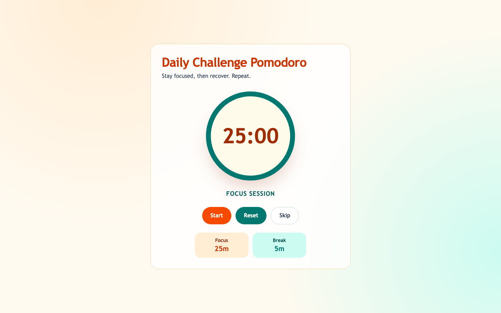

# Daily Challenge Pomodoro Timer

[](https://github.com/Tadwork/vibe-pomodoro-daily-challenge/actions/workflows/ci.yml)
[](https://github.com/Tadwork/vibe-pomodoro-daily-challenge/actions/workflows/ci.yml)

A simple Node.js + Tailwind Pomodoro timer app with focus and break cycles.

You can click the Focus or Break cards to edit minutes inline. Clicking away saves only valid values.
The app plays a configurable sound at the end of each session and stores preferences (focus, break, sound, volume) in localStorage.

## Features

- Inline editing for focus and break durations
- Session-end alert sound (about 2 seconds)
- Sound preset selection (`Chime`, `Bell`, `Digital`)
- Adjustable alert volume (`0%-100%`)
- Wall-clock timer sync to reduce drift in background tabs
- Persistent preferences via localStorage

## Live App

GitHub Pages deployment: https://tadwork.github.io/vibe-pomodoro-daily-challenge/

## Screenshot



## Run locally

```bash
npm install
npm run build:css
npm start
```

Open `http://localhost:3000`.

## Test and coverage

```bash
npm test
npm run test:coverage
```

Current automated test coverage scope is `lib/**/*.js` and `public/timer-utils.js`.
